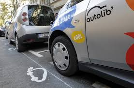

# Descriptive-and-inferential-analysis
Autolib Hypothesis Testing

# Description:

The project seeks to find out the following research questions:

1.Is the number of blue cars taken different in the region with the postal codes 75015 and 75017 during weekdays?

2.Is the number of blue cars taken in the region with the postal code 75015 greater than 75017 during weekdays?

3.Is the number of blue cars taken different in the region with the postal codes 75015 and 75017 during weekends?

4.Is the number of blue cars taken in the region with the postal code 75015 greater than 75017 during weekends?

The variables under investigation include:Postal code, Date, n_daily_data_points,  dayOfWeek,  day_type,  BlueCars_taken_sum, BlueCars_returned_sum, Utilib_taken_sum, Utilib_returned_sum, Utilib_14_taken_sum, Utilib_14_returned_sum, Slots_freed_sum ,Slots_taken_sum .

# Installation:
Jupyter notebook

Python libraries(numpy, pandas, matplotlib, seaborn, statistics, maths and scipy)

# Support
In case of any clarifications or suggestions with regards to this project email me at ngolua.kinya@gmail.com

# Licenses
MIT License

Moringa school 2020
